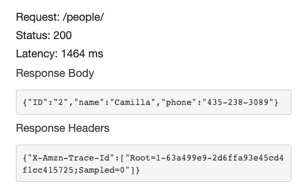
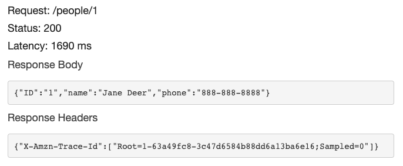
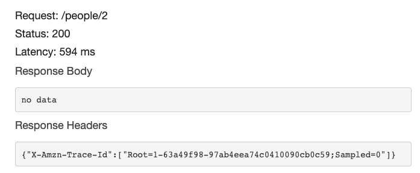

# dynamo-lambda-lab-18

### Passing Get All Test

### Passing Get One Test

### Passing Create Test

### Passing Update Test

### Passing Delete Test

# Lab Questions

1. What is the root URL to your API?
- [Deployed Link](https://ex2ad47p42.execute-api.us-west-2.amazonaws.com/Production/people)

1. What are the routes?
- /people
- /people/id

2. What inputs do they require?
- GET: no input for get all, input of id number for get one
- CREATE: input of new json data
- UPDATE: input of id number and updated json data
- DELETE: input of id number

3. What output do they return?
- GET: get all returns an array of objects, get one returns an object representing one record, by its id number
- CREATE: inserts a record into the database
- UPDATE: updates a record in the database and returns an object representing on record by its id number
- DELETE: returns an empty object

# Process

## DynamoDB
1. Create table
2. Partition key (primary key). Call it ID
3. Default table settings

## API Gateway

1. Build non private REST API 
2. Rest, New API
3. Name

4. Create a resource
5. /people route
6. Add all methods by highlighting route, clicking actions, method and selecting the method
7. Lambda Function
8. Use lambda proxy integration
9. Select handler after its been created

10. After Lambda function is built and works, do method test by clicking on method file and selecting test
11. Add JSON data to the request body for create and update handlers
12. In /people route, create a new resource with {id} to create the delete method
13. For delete handler test, include the {id} of object

## IAM

1. Add DynamoDBFullAccess to each handler role after the handlers have been created, found in roles in access management

## Lambda

1. Create new function
2. Handlers
3. Node.js 18 and x86_64
4. In function code, change handler to exports.handler

## VSCode
1.  DynamoDB folder
2. Add handlers as folders and add indexes to each

## Terminal
1. Navigate to handler folder for each handler after its created to AWS
2. Check node version
3. Nvm use 18
4. Npm init -y
5. Npm i dynamoose

## VSCode
1. Add start script to package.json node index.js
2. Zip each handler folder with node modules, index, package lock and package json including node modules. Highlight all 4 files at the same time and compress 

## Lambda
1. Upload each handler folder
2. In index.js, require dynamoose, get basic schema example from dynamoose documentation for all CRUD methods

## DynamoDB
1. In people table, create an item
2. Enter key value pairs and create item
3. From dynamoose docs, get model.scan filter example code

## Lambda
1. Configure test event
2. Use API Gateway AWS Proxy template
3. Keep private
4. In body, take out string and make it an object

## Monitor Cloudwatch for success and debugging

## Deploy

In resources, deploy API, stage name production and Deploy. Add /people route at the end of the url to get data

## Credits and Collaboration:
Worked with [Kenny Lino]()
